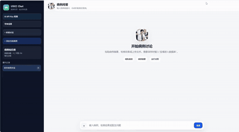

# AI for Medical Science

UroSCC-LS Risk AI is a Flask-based medical science prototype for case entry, local knowledge-base retrieval, risk-factor explanation, and assisted discussion around male urethral squamous cell carcinoma and lichen sclerosus related clinical evidence.

This project is intended for teaching, research discussion, and prototype demonstration. It is not a medical device and must not be used as a diagnosis, staging, treatment, or triage system.

## Download Now

| Windows | macOS | Linux |
| --- | --- | --- |
| **[Download Windows ZIP](https://github.com/lihao123456521/AI-for-medical-science/releases/latest/download/AI-for-medical-science-windows.zip)** | **[Download macOS TAR.GZ](https://github.com/lihao123456521/AI-for-medical-science/releases/latest/download/AI-for-medical-science-macos.tar.gz)** | **[Download Linux TAR.GZ](https://github.com/lihao123456521/AI-for-medical-science/releases/latest/download/AI-for-medical-science-linux.tar.gz)** |

Windows users: extract the ZIP and double-click `AI-rare-disease-assistant.exe`. The launcher opens the chat UI automatically and creates a desktop shortcut with the themed doctor-patient app icon. `start_windows_local.bat` is kept as a fallback.

## Promotional Video



<video src="docs/media/ai-rare-disease-treatment-promo-small.mp4" poster="docs/media/promo-poster.jpg" autoplay muted loop playsinline controls preload="auto" width="100%">
  <a href="docs/media/ai-rare-disease-treatment-promo-small.mp4">Play the promotional video</a>
</video>

If your browser blocks video playback, open the compressed demo here: [AI rare disease treatment video](docs/media/ai-rare-disease-treatment-promo-small.mp4).

## Download Packages

The packages are portable source-based installers. Users need Python 3.10 or newer; the package startup scripts create a virtual environment and install the required Python libraries.

| System | Download | How to start |
| --- | --- | --- |
| Windows | [AI-for-medical-science-windows.zip](https://github.com/lihao123456521/AI-for-medical-science/releases/latest/download/AI-for-medical-science-windows.zip) | Extract the zip, then double-click `AI-rare-disease-assistant.exe`; it opens an app-style window and creates a desktop shortcut automatically |
| macOS | [AI-for-medical-science-macos.tar.gz](https://github.com/lihao123456521/AI-for-medical-science/releases/latest/download/AI-for-medical-science-macos.tar.gz) | Extract, open Terminal in the folder, run `bash run_mac_linux.sh` |
| Linux | [AI-for-medical-science-linux.tar.gz](https://github.com/lihao123456521/AI-for-medical-science/releases/latest/download/AI-for-medical-science-linux.tar.gz) | Extract, open a terminal in the folder, run `bash run_mac_linux.sh` |

After startup, open:

```text
http://127.0.0.1:5000
```

## More Notes

Older version notes, release notes, deployment notes, and security notes are collected in [docs/notes](docs/notes/README.md) so the project root stays clean.

## What It Does

- Structured case entry for symptoms, imaging, pathology, immunohistochemistry, and clinical notes.
- Number-aware multi-case document splitting with PDF image-to-case ownership and annotation retention.
- Local knowledge-base search from `data/knowledge_base.xlsx`.
- Transparent risk-factor extraction and rule-based scoring.
- Similar-case retrieval only after a detailed case is confirmed or explicitly requested.
- Optional OpenAI-compatible API integration for explanatory summaries.
- Upload parsing for Excel, CSV, Word, text, PDF, and image attachments.

The June 2026 imaging import added 17 annotated cases from `影像片子汇总.pdf` while preserving the existing 76 user cases and 230 articles. See [the V37 change notes](docs/notes/README_V37_CHANGES.md) for import, chat-routing, and API-request details.

V38 bundles an audited, de-identified public seed library with **93 cases and 230 articles**. A fresh installation copies this library into its local runtime directory automatically, so downloaded copies can use the same knowledge base immediately. Existing local libraries are never overwritten. See [the V38 change notes](docs/notes/README_V38_CHANGES.md).

## Quick Start From Source

### Windows

```powershell
python -m venv .venv
.\.venv\Scripts\Activate.ps1
pip install -r requirements.txt
if (!(Test-Path .env)) { Copy-Item .env.example .env }
python app.py
```

Or double-click:

```text
start_windows_local.bat
```

On Windows, `windows_launcher.pyw` starts the local Flask service, waits until it is healthy, and then opens the chat UI in an Edge/Chrome app-style window.

### macOS / Linux

```bash
python3 -m venv .venv
source .venv/bin/activate
pip install -r requirements.txt
[ -f .env ] || cp .env.example .env
python app.py
```

Or run:

```bash
bash run_mac_linux.sh
```

## Optional AI API Configuration

Copy `.env.example` to `.env`, then fill in your API key if you want AI-generated explanatory summaries.

```env
OPENAI_API_KEY=
OPENAI_MODEL=gpt-4.1-mini
FLASK_SECRET_KEY=change-this-in-production
DATA_PATH=data/knowledge_base.xlsx
```

The app can still run with local rules and knowledge-base retrieval when no API key is configured.

API calls use bounded output lengths, provider-aware timeouts, streaming where supported, and no automatic SDK retries. A timeout message includes a request ID and warns that the provider may already have accepted the request, so users can check provider records before sending it again.

API configurations are saved to the local runtime directory before the connection test runs, so a slow or temporarily unavailable provider no longer discards the key. Remembered configurations can be switched without typing the key again. Full API keys remain only in the local runtime directory and are never included in the repository, public seed database, or release packages.

Chat requests use streaming, compact database evidence, bounded output, zero automatic retries, and a longer inactivity window for slower providers such as DeepSeek. This reduces time to first visible text while avoiding duplicate paid requests caused by automatic retries.

The Windows launcher verifies the running service build before opening it, so an older installation on port 5000 cannot silently receive requests from a newer desktop shortcut. Provider token-rate-limit errors are sanitized, keep the reset time when supplied, and never expose provider API-key identifiers or trigger an automatic paid retry.

## Repository Structure

```text
.
|-- app.py
|-- core/
|   |-- case_parser.py
|   |-- data_loader.py
|   |-- llm_client.py
|   `-- risk_engine.py
|-- data/
|   |-- seed/
|   |   |-- user_cases.json
|   |   |-- articles.json
|   |   `-- manifest.json
|   |-- knowledge_base.xlsx
|   `-- knowledge_base_manifest.json
|-- static/
|-- templates/
|-- scripts/
|-- docs/
|   |-- media/
|   `-- notes/
`-- dist/
```

## Security And Data Notes

- Do not upload identifiable patient information to public GitHub repositories.
- Do not commit `.env` or API keys.
- Treat uploaded case files, runtime logs, and generated local data as sensitive. By default, user-fed cases and articles are stored in the Windows user directory `~/.uscc_scc_flask_data`.
- The bundled seed library removes identity fields, exact clinical dates, local file paths, uploaded image references, and API credentials. Original clinical images are not published.
- Public demonstrations should use synthetic or fully de-identified cases only.
- Every output should be reviewed by qualified medical professionals before any real-world interpretation.

## Deployment

For a cloud demo, use the included `render.yaml` or deploy the Flask app behind Gunicorn/Nginx on a controlled server. Before public deployment, add authentication, audit logging, data retention controls, and a complete privacy review.

## Rebuild Download Packages

From the project root on Windows PowerShell:

```powershell
powershell -ExecutionPolicy Bypass -File scripts/build_release_packages.ps1
```

Generated packages are written to `dist/`.
